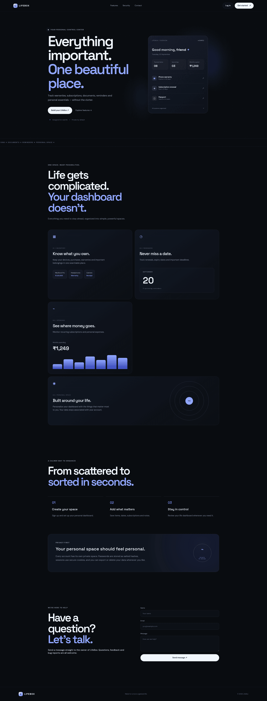

## 📸 Website Preview


# LifeBox 📦

Warranties, belongings, subscriptions and reminders in one private dashboard.
Runs on Vercel with a free Neon PostgreSQL database.

## Files
- `public/` static pages: `index.html` (landing), `dashboard.html`, `app.js`, `app.css`, `style.css`, `script.js`
- `backend/main.js` the API (accounts, belongings, subscriptions, reminders, contact form)
- `api/index.js` connects the API to Vercel
- `dev.js` local development only
- `vercel.json` routing

## Deploy on Vercel
1. Push this folder to a GitHub repository.
2. On vercel.com choose Add New > Project, import the repo, and leave every setting as it is. Deploy.
3. In the project: Storage > Create Database > Neon > connect it to the project. This adds `DATABASE_URL` automatically.
4. Optional, for emailed contact messages: Settings > Environment Variables, add `OWNER_EMAIL`, `SMTP_HOST`, `SMTP_PORT`, `SMTP_USER`, `SMTP_PASS`.
5. Deployments > Redeploy so the new variables take effect.

Tables are created automatically the first time the site is used.

## Reading contact messages
Open your Neon dashboard > SQL Editor and run `select * from messages order by id desc;`

## Run locally
Needs Node 20.12+ and a Postgres URL in `.env` (copy `.env.example`).
```
npm install
npm start
```
